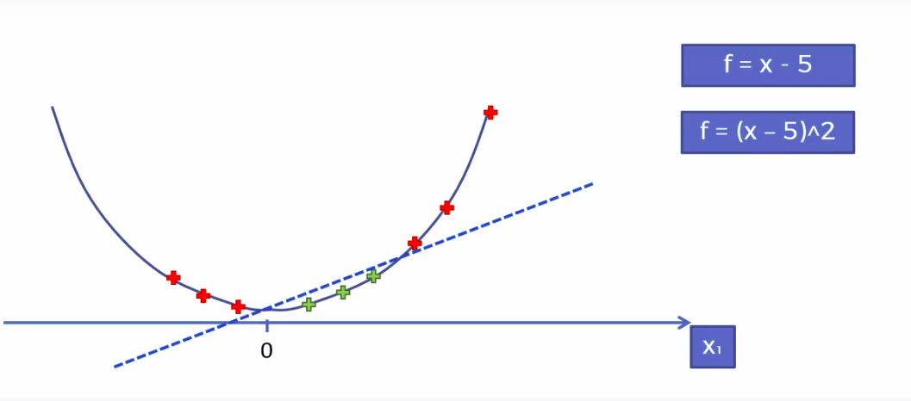
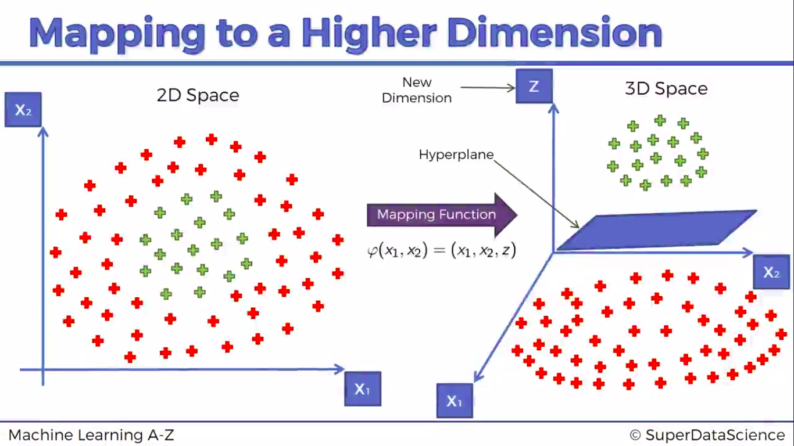
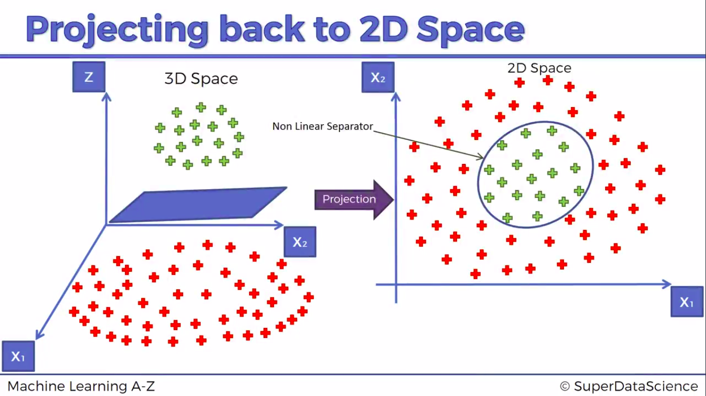
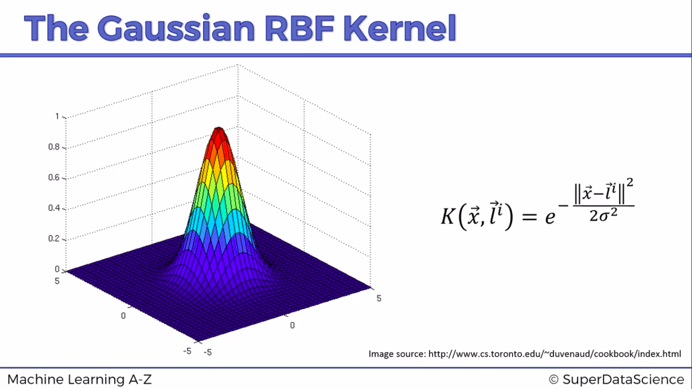

# Kernel Support Vector Machine

Used when data is not linearly seperable. It is possible to draw a bpundary but not linearly. It helps choose optimal decision boundary/multiple decision boundary.

### A higher dimensional space

  

Similarly, we can have many mapping functions like

 

########## Problem here is mapping to a higher dimensional space can be  highly compute-intensive

## The Gaussian RBF kernel

 K (x, li) = e -(||x -  li||2) / (2*sigma2)

 