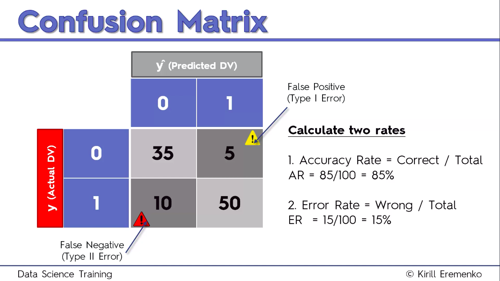
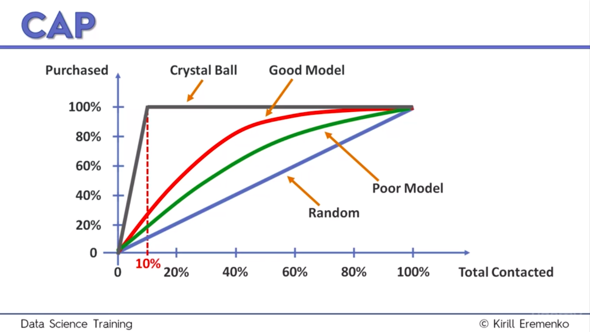

# False Positive and Negatives

1) False Positive(Type 1 error): We predicted a positive outcome but it was false. Predicted an effet that did not occur. [Less Dangerous]
2) False Negative(Type 2 error): We predicted that there won't be any effect but it actually did occur. Our prediction was negative. [More Dangerous]

# Confusion Matrix

###### Accuracy Paradox:
If 00 = more, 01 = 0, 01 = less, 11 = 0
Accuracy increases, although we did not train. So accuarcy cannot be always trusted.

#CAP: Cummulative Accuracy Profile.
Greater area under the curve, the better is the model.  
